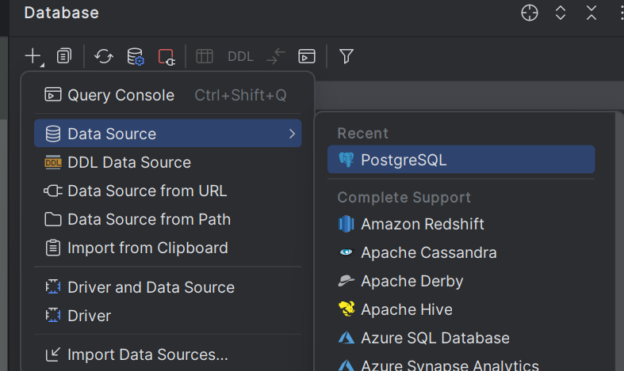
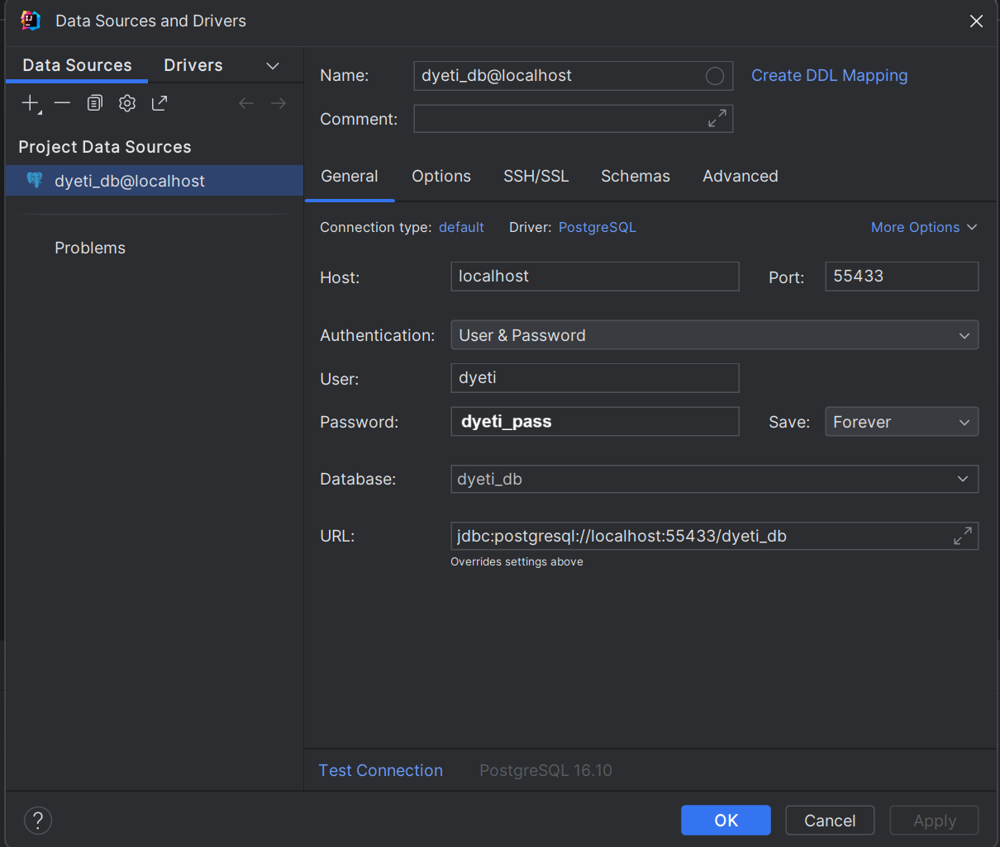

## Krok po kroku

### 1. Uruchomić **Docker Desktop**  

( albo **Rancher Desktop**, czy jakikolwiek inny program, który ogarnia Dockera )

### 2.
#### `!` deprecated `!` teraz jest to wszystko w jednym, głównym docker-compose

w katalogu `\Diet-Optimization-App\miscellaneous\postgres-databse`

```bash
docker compose build
```
### 3.
```bash
docker compose up -d
```

### 4. ( dla testu  )
wchodzenie do kontenera na windowsie:
```bash
docker exec -it $(docker ps -q -f "name=dyeti-postgres") bash
```

i na linuxie / macu:
```bash
docker exec -it "$(docker ps -q -f name=dyeti-postgres)" bash
```
( wychodzi się przez komedne exit z terminala )

### 5. łączenie sie z Intelij

kliknąć tu:  



I następnie tak uzupełnić:



### tak uzupełnić

| Klucz    | Wartość                 |
|----------|--------------------------|
| Host     | 127.0.0.1                |
| User     | dyeti                    |
| Password | dyeti_pass               |
| Port     | 55433                    |
| Database | dyeti_db                 |
| URL      | jdbc:postgresql://127.0.0.1:55433/dyeti_db |

na screenie jest ssl disable, bez tego powinno działać, automatyczny URL powinen być okej

---
Note:
- 127.0.0.1 (nie localhost, bo zinterpretuje po swojemu i się nie będzie działać)
- 55433 (taki duży, bo na mniejszych Bóg wie czemu nie chce działać)

### 6. query
**plusik → Query Console**
 
```sql
select * from products
```

Powinno się ładnie wypisać. Jeśli nie, to wejść do kontenera ( punkt 4 ) i ręcznie odpalić
`03_load_data.sh`

```bash
cd docker-entrypoint-initdb.d
```
```bash
sh 02_load_data_1.sh 
```

### 7.

usunięcie i zburzenie kontenera:

```bash
docker compose down -v
```